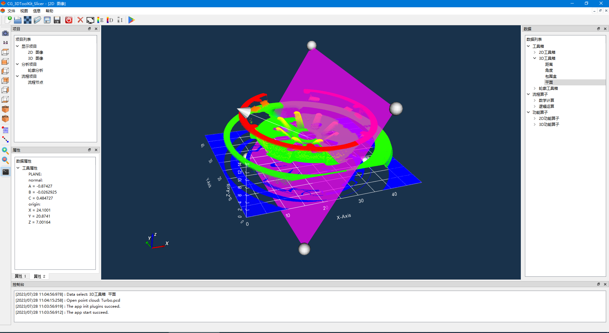
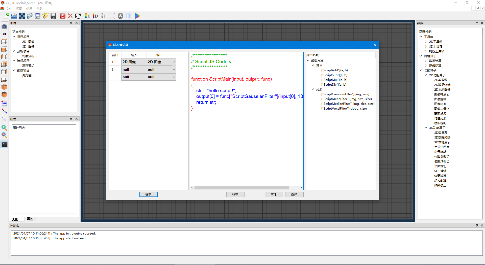

# CG_3DToolKit_Slicer

 CG_3DToolKit_Slicer
-------

 Description
-------
CG_ 3DToolKit_ Slicer is a platform that integrates 2D and 3D universal machine vision algorithms.  Programming in the form of flow graphics and drag and drop node blocks.  It has the characteristics of being intuitive, simple, and easy to operate.  Making machine vision programming less complex and highly popular among users.  Integrate 2D, 3D display, interaction, contour, algorithm, and other functions.  Develop using C++11 and Qt5.

 Issue
-------
There are still have a few unresolved issues:
1. Implementation of the arc tool for 2D image.
2. Implementation of the browser embedding in the interface window.
3. Upgrade to MSVC2019 or above and the third-party library to latest.
4. Add more functional algorithm plugins.
5. We need everyone's joint assistance and contribution.

Interface Image
-------
* Main flow graph

* Graphical programming

* 2D distplay

* 3D display

* 3D interaction

* Profile chart

* Script edit

* CAD modleing


Depend
-------
The 3rd party library:

Qt5 
>\>=5.12.12

OpenCASCADE
>\>=7.3.0

OpenCV
>\>=3.4.1

PCL
>\>=1.8.1

Citation
--------
We encourage other researchers to cite CG_ 3DToolKit_ Slicer if they use CG_ 3DToolKit_ Slicer or its components for their work or baselines. The bibtex entry for the same is
```
@InProceedings{Tim_CG_ 3DToolKit_ Slicer,
  author    = {Tim Hong},
  title     = {{CG_ 3DToolKit_ Slicer}},
  booktitle = {{IEEE International Conference on Robotics and Automation (ICRA)}},
  month     = {Aug 3-8},
  year      = {2023},
  address   = {GuangZhou, China},
  publisher = {IEEE}
}
```